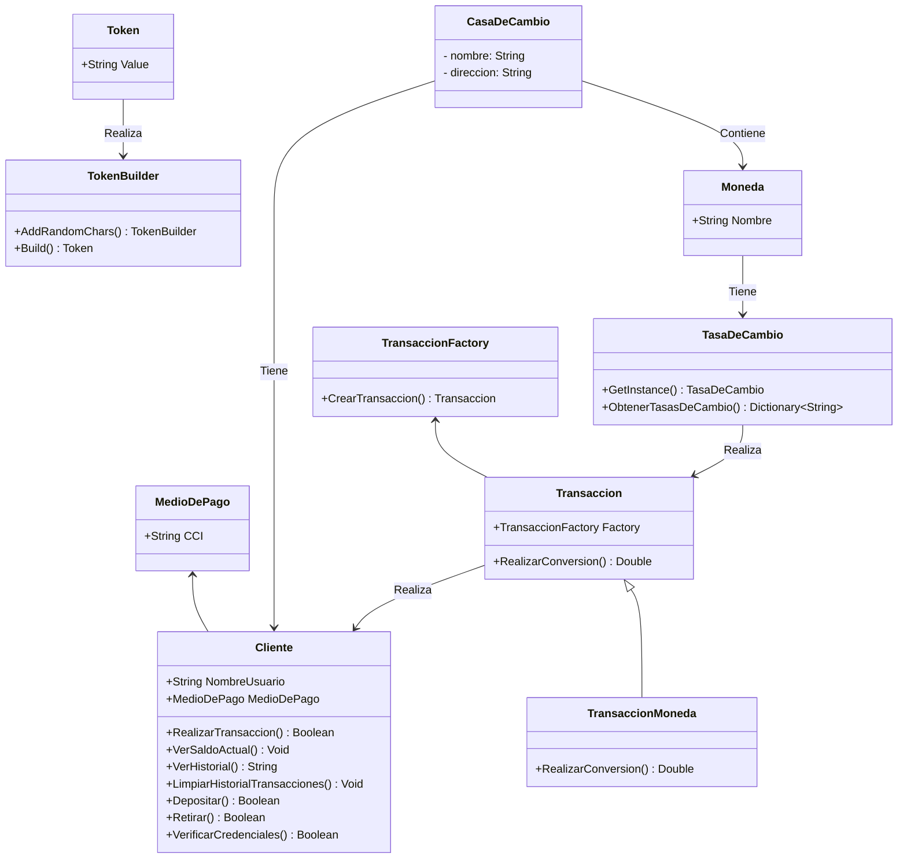

```mermaid
classDiagram

class CasaDeCambio {
    - nombre: String
    - direccion: String
}

class Cliente
Cliente : +String NombreUsuario
Cliente : +MedioDePago MedioDePago
Cliente : +RealizarTransaccion() Boolean
Cliente : +VerSaldoActual() Void
Cliente : +VerHistorial() String
Cliente : +LimpiarHistorialTransacciones() Void
Cliente : +Depositar() Boolean
Cliente : +Retirar() Boolean
Cliente : +VerificarCredenciales() Boolean

class MedioDePago
MedioDePago : +String CCI

class Moneda
Moneda : +String Nombre

class TasaDeCambio
TasaDeCambio : +GetInstance() TasaDeCambio
TasaDeCambio : +ObtenerTasasDeCambio() Dictionary~String~

class Token
Token : +String Value

class Transaccion
Transaccion : +TransaccionFactory Factory
Transaccion : +RealizarConversion() Double

class TransaccionMoneda
TransaccionMoneda : +RealizarConversion() Double

class TransaccionFactory
TransaccionFactory : +CrearTransaccion() Transaccion

class TokenBuilder
TokenBuilder : +AddRandomChars() TokenBuilder
TokenBuilder : +Build() Token


MedioDePago <-- Cliente
TransaccionFactory <-- Transaccion
Transaccion <|-- TransaccionMoneda
CasaDeCambio --> Moneda : Contiene
Moneda --> TasaDeCambio : Tiene
TasaDeCambio --> Transaccion : Realiza
Transaccion --> Cliente : Realiza
CasaDeCambio --> Cliente : Tiene
Token --> TokenBuilder : Realiza

```
